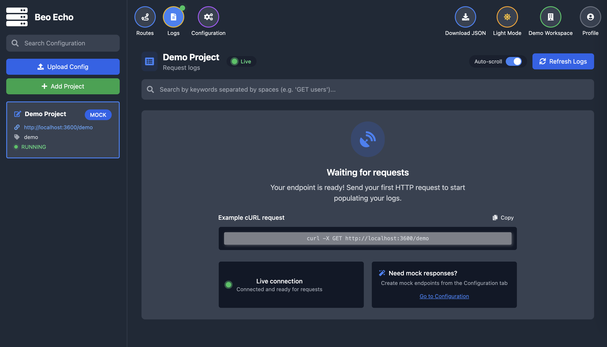

# Beo Echo

<div align="center">
  
  <h3>A Powerful API Mocking and Request Forwarding Service</h3>
  <p>Create mock APIs, forward requests, and manage API behaviors with ease</p>
  
  
  
  
</div>

## 📖 About

Beo Echo is an API mocking service that combines the power of Golang backend and Svelte frontend. It's designed for developers, testers, and API designers who need a reliable way to mock API responses, forward requests, and simulate various API behaviors.

Similar to tools like Beeceptor and Mockoon, Beo Echo provides an intuitive user interface for managing your mock APIs without the need for complex configurations.

## 🚀 Features

- **Mock API Creation**: Create mock API endpoints with customizable responses
- **Request Forwarding**: Forward requests to actual backend services
- **Response Templates**: Use dynamic templates for response generation
- **Request Logging**: Track and analyze all incoming requests
- **API Authentication**: Secure your mock APIs
- **Rule-Based Responses**: Configure different responses based on request parameters
- **Latency Simulation**: Test your application's behavior under various network conditions
- **Multiple Workspaces**: Organize your mock APIs in separate workspaces
- **Dark/Light Mode**: User-friendly interface with theme support

## 🛠️ Tech Stack

- **Backend**: Go, Gin, GORM, SQLite 
- **Frontend**: SvelteKit, TypeScript, Tailwind CSS
- **Deployment**: Docker

## 🐳 Docker

Get started quickly with our Docker image:

```bash
docker pull ghcr.io/yogasw/beo-echo:latest
docker run -p 8080:8080 ghcr.io/yogasw/beo-echo:latest
```

## 📸 Screenshots

### Dashboard


### Request Logs


### API Configuration


## 📜 License

This project is licensed under the MIT License - see the [LICENSE](LICENSE) file for details.
